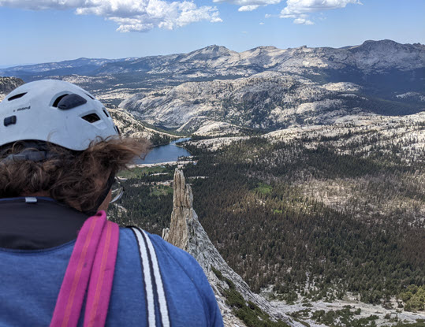
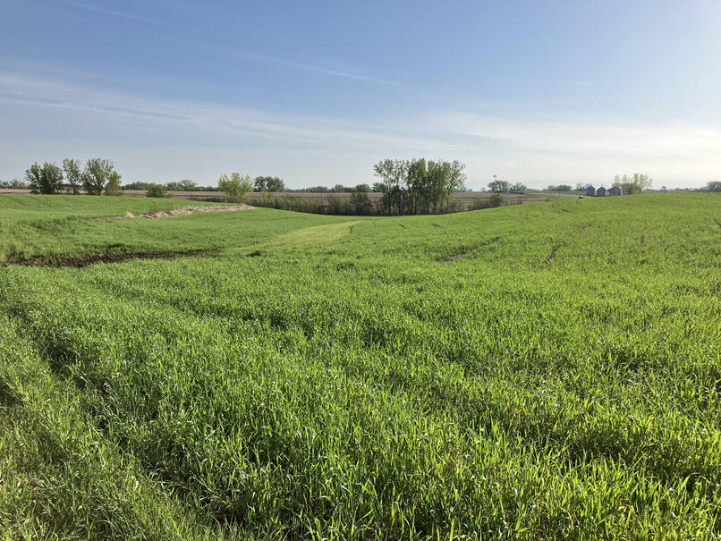

### Hi there 👋

I'm working on ArcGIS Pro technical documentation. Check it out at https://pro.arcgis.com/en/pro-app/latest/get-started/get-started.htm. But if it's outside business hours, I might be climbing 🧗‍♂️ or working on the family farm 🚜.

|  |  |
| :---: | :---: |

|  |  |
| :---: | :---: |
| Planting cereal rye as a winter cover crop to **capture carbon**, **reduce erosion**, and **build up organic matter** in the soil. | Enjoying the sight of it in springtime. |

Robert Garrity
